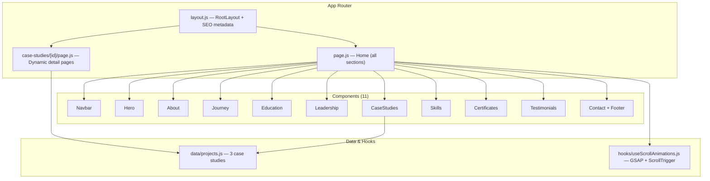

# 🗂️ Portfolio v2 — Project Walkthrough

> A comprehensive guide to the architecture, features, and code conventions of this portfolio project.

---

## 📌 Overview

A **professional portfolio website** for a Software Project Manager, built as a single-page application with an additional dynamic route for case study deep-dives. The design features a dark theme with glassmorphism, GSAP scroll animations, and fluid responsive typography.

---

## 🛠️ Tech Stack

| Layer | Technology | Version |
|-------|-----------|---------|
| Framework | **Next.js** (App Router) | `16.x` |
| UI Library | **React** | `19.x` |
| Animation | **GSAP** + ScrollTrigger | `^3.15` |
| Styling | **CSS Modules** + Global CSS | Vanilla |
| Compiler | **React Compiler** (babel plugin) | `1.0.0` |
| Fonts | Google Fonts (`Bricolage Grotesque`, `Inter`) | — |

> **Note:** The project uses Next.js 16 with the React Compiler enabled (`reactCompiler: true` in `next.config.mjs`).

---

## 🏗️ Architecture



---

## 📁 File Structure

```
src/
├── app/
│   ├── globals.css              ← Design system tokens & utilities
│   ├── layout.js                ← Root layout with SEO metadata
│   ├── page.js                  ← Home page (assembles all sections)
│   ├── page.module.css          ← Home page specific styles
│   └── case-studies/
│       └── [id]/
│           ├── page.js          ← Dynamic case study detail page
│           └── page.module.css
├── components/
│   ├── Navbar/                  ← Fixed navigation + mobile hamburger
│   ├── Hero/                    ← Hero with photo, stats, timeline
│   ├── About/                   ← Philosophy + CSPO badge highlight
│   ├── Journey/                 ← Career timeline (2020–Present)
│   ├── Education/               ← Academic background + thesis
│   ├── Leadership/              ← Organizational leadership roles
│   ├── CaseStudies/             ← Project cards grid → detail pages
│   ├── Skills/                  ← Bento grid + progress bars
│   ├── Certificates/            ← Horizontal scrollable carousel
│   ├── Testimonials/            ← Testimonial quote cards
│   └── Contact/                 ← CTA section + social links + footer
├── data/
│   └── projects.js              ← Case study data objects
└── hooks/
    └── useScrollAnimations.js   ← Central GSAP animation orchestrator
```

Each component follows a consistent structure:
```
ComponentName/
├── ComponentName.js             ← Main component logic
├── ComponentName.module.css     ← Scoped styles (CSS Module)
└── index.js                     ← Barrel re-export
```

---

## 🧩 Sections & Features

### 1. Navbar
- **Fixed top navigation** with 8 anchor links
- **Scroll-triggered styling**: glassmorphic background after 50px scroll
- **Mobile hamburger**: slide-down panel with body scroll lock
- **Smooth scrolling**: `scrollIntoView({ behavior: 'smooth' })`
- **Accessibility**: `aria-label`, `aria-expanded`, `aria-controls`, `role="navigation"`

### 2. Hero
- **Two-column layout** (desktop): content (left) + profile photo with floating stat cards (right)
- **Process timeline**: 4 connected dots — Discovery → Planning → Execution → Launch
- **Profile photo**: glassmorphic frame with animated glow, SVG fallback on image error
- **3 floating stat cards**: positioned absolutely around the photo (hidden on mobile, replaced with a horizontal row)
- **CTA buttons**: "View My Work" + "Get In Touch"

### 3. About
- **Two-column layout**: narrative philosophy text + CSPO credential highlight card
- Highlight card: official badge image, pulsing glow border, and 5 competency bullet points

### 4. Journey
- **Vertical timeline** with alternating left/right cards
- **5 career milestones** from 2020 to Present
- Glowing timeline nodes with staggered scroll animations

### 5. Education
- Single academic card with institution logo (`next/image`)
- Thesis highlight section with detail bullet points

### 6. Leadership
- **2-card grid** with official organization logos
- Each card: role title, organization name, and detail bullet list

### 7. Case Studies
- **3 project cards** linking to `/case-studies/[id]`
- Cards: gradient preview area with icon → title → description → metric badges
- Data-driven from `src/data/projects.js`

### 8. Case Study Detail Page (`/case-studies/[id]`)
- **Dynamic route** using `use(params)` (Next.js 16 async params pattern)
- **Not-found fallback** with return-to-portfolio link
- **Hero section**: project icon, title, and metric badges
- **Two-column body**:
  - Sidebar (right): role, client, duration, team size, key deliverables
  - Main body (left): 3 narrative sections — Challenge, Strategy, Results
- **Footer CTA**: links back to home and contact section

### 9. Skills
- **Bento grid**: 2 large cards, 1 medium card, 6 small tool cards
- **3 animated progress bars** with GSAP-driven width transitions

### 10. Certificates
- **Horizontal scrollable carousel** with left/right arrow navigation via `useRef`
- 6 certificates with actual preview images
- Each card: gradient overlay + image → issuer, title, date, credential ID, "Verify Credential" link

### 11. Testimonials
- **3 quote cards** with decorative quotation marks
- Avatar circles with initials + name/role

### 12. Contact + Footer
- **CTA section**: heading, subtitle, email + resume buttons
- **Social links**: LinkedIn, GitHub, Email (inline SVG icons)
- **Footer**: copyright line

---

## 🎨 Design System — `globals.css`

### Color Palette

| Token | Value | Usage |
|-------|-------|-------|
| `--bg-primary` | `#0a0f1c` | Dark navy background |
| `--bg-secondary` | `#131b2e` | Slightly lighter sections |
| `--bg-tertiary` | `#1a2340` | Cards / elevated surfaces |
| `--accent-blue` | `#3389f2` | Primary accent |
| `--accent-purple` | `#7b61ff` | Gradient partner |
| `--accent-orange` | `#ff5f29` | Alert / highlight accent |
| `--accent-green` | `#00c9a7` | Success accent |
| `--text-primary` | `#ffffff` | Headings |
| `--text-secondary` | `#94949e` | Body text |
| `--text-muted` | `#5a5a66` | De-emphasized text |

### Typography

| Token | Value |
|-------|-------|
| `--font-heading` | `'Bricolage Grotesque', system-ui, sans-serif` |
| `--font-body` | `'Inter', system-ui, sans-serif` |
| `--fs-display` | `clamp(2.8rem, 6vw, 5rem)` |
| `--fs-h1` | `clamp(2.2rem, 4.5vw, 3.5rem)` |
| `--fs-h2` | `clamp(1.8rem, 3.5vw, 2.8rem)` |
| `--fs-body` | `clamp(0.95rem, 1.2vw, 1.1rem)` |

### Design Patterns

- **Glassmorphism**: `.glass-card` — `backdrop-filter: blur(12px)`, semi-transparent borders and backgrounds
- **Gradient text**: `.gradient-text` — blue-to-purple gradient fill
- **Fluid typography**: All font sizes use `clamp()` for responsive scaling without media queries
- **Custom scrollbar**: Thin 6px styled scrollbar with accent hover color
- **Dot grid pattern**: `.dot-pattern` — subtle repeating radial-gradient background decoration

### Utility Classes

| Class | Purpose |
|-------|---------|
| `.gradient-text` | Blue-to-purple gradient text |
| `.section-header` | Centered section heading with bottom margin |
| `.glass-card` | Glassmorphic card with hover effects |
| `.btn` / `.btn-primary` / `.btn-outline` | Button system |
| `.badge` | Small accent badge |
| `.dot-pattern` | Background decoration |

---

## 🎬 Animation System — `useScrollAnimations.js`

A centralized GSAP + ScrollTrigger hook called once from the home page. All initial hidden states are defined in CSS via `[data-animate]` attribute selectors.

### Scroll-Triggered Animations

| Data Attribute | Effect | Duration | Ease |
|---------------|--------|----------|------|
| `data-animate="fade-up"` | Opacity 0→1, Y +40→0 | 0.8s | `power3.out` |
| `data-animate="fade-in"` | Opacity 0→1 | 1.0s | `power2.out` |
| `data-animate="float-in-left"` | Opacity 0→1, X −60→0 | 0.9s | `power3.out` |
| `data-animate="float-in-right"` | Opacity 0→1, X +60→0 | 0.9s | `power3.out` |
| `data-animate="scale-in"` | Opacity 0→1, Scale 0.9→1 | 0.8s | `back.out(1.7)` |
| `data-animate="card-rise"` | Opacity 0→1, Y +60→0 (staggered in `[data-card-group]`) | 0.7s | `power3.out` |
| `data-animate="timeline-item"` | Opacity 0→1, Y +30→0 (staggered by index) | 0.7s | `power3.out` |
| `data-animate="progress"` | Width 0% → `data-progress`% | 1.2s | `power3.out` |

### Hero-Specific Animations (load-triggered, not scroll-triggered)

| Target | Effect | Delay |
|--------|--------|-------|
| `[data-hero-stat]` | Float in with 0.2s stagger | 0.5s |
| `[data-process-node]` | Scale in with bounce (`back.out(2)`) | 1.0s |
| `[data-process-line]` | ScaleX 0→1 from left | 0.8s |
| `[data-hero-content]` | Fade up | 0.2s |

> The hook uses `gsap.context()` for proper cleanup on component unmount.

---

## 🧭 Routing

| Route | Type | Description |
|-------|------|-------------|
| `/` | Static | Home page — all 11 sections assembled |
| `/case-studies/[id]` | Dynamic | Individual case study detail page |

**Valid case study IDs:** `case-ecommerce`, `case-fintech`, `case-healthcare`

The detail page uses `use(params)` to unwrap Next.js 16's async params object and looks up the matching project from the shared `projects.js` data file.

---

## 📦 Assets — `public/images/`

| File | Usage |
|------|-------|
| `profile.jpg` | Hero section profile photo |
| `cspo-badge.png` | About section — CSPO credential badge |
| `logo-bracu.png` | Education section — university logo |
| `logo-basis.png` | Leadership section — organization logo |
| `logo-bucc.png` | Leadership section — organization logo |
| `cert-*.jpg` (×6) | Certificate preview images in carousel |

---

## 🔍 SEO

The root `layout.js` exports metadata for:

- **Title tag** & **meta description**
- **Keywords** array
- **Open Graph** (title, description, type, locale)
- **Twitter Card** (summary_large_image)
- **Google Fonts** preconnect links in `<head>`

---

## 🧱 Component Conventions

Every component in this project follows a consistent pattern:

1. **`'use client'` directive** — required for GSAP and interactive features
2. **CSS Module import** — `import styles from './Component.module.css'`
3. **Barrel export** via `index.js` — `export { default } from './Component'`
4. **Data-driven rendering** — arrays of objects mapped to JSX
5. **`data-animate` attributes** — picked up by the central scroll animation hook
6. **Semantic HTML** — `<section>`, `<article>`, `<header>`, `<nav>`, `<footer>`, `<blockquote>`
7. **Accessibility** — `aria-label`, `aria-hidden`, `role` attributes throughout
8. **Unique IDs** — all interactive elements have descriptive IDs for testing

---

## 🚀 Getting Started

```bash
# Install dependencies
npm install

# Run development server
npm run dev

# Build for production
npm run build

# Start production server
npm run start
```

---

## 📄 License

© Md. Abu Hanif Siam. All rights reserved.
